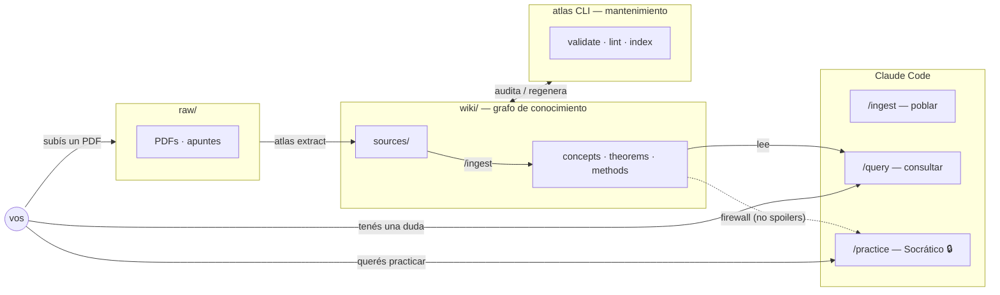

# Atlas

[](https://github.com/AndresPaladino/atlas/actions/workflows/ci.yml)
[](https://www.python.org/)
[](LICENSE)

Sistema personal de conocimiento construido sobre [Claude Code](https://claude.ai/code) inspirado en [LLM Wiki](https://gist.github.com/karpathy/442a6bf555914893e9891c11519de94f) de Andrej Karpathy. Mantiene un wiki interconectado que se popula, consulta y practica con sesiones de Claude. Incluye un CLI (`atlas`) para extracción de PDFs y mantenimiento del grafo.



## Instalación

```bash
git clone https://github.com/AndresPaladino/atlas.git
cd atlas
bash setup.sh
```

`setup.sh` crea la estructura del wiki e instala el CLI `atlas`.

## Uso

```bash
claude   # abrir Claude Code en la raíz del repositorio
```

| Comando | Para qué |
|---|---|
| `/ingest [ruta]` | Cargar una fuente (PDF, nota) al wiki |
| `/query <pregunta>` | Consultar el wiki |
| `/practice [tema]` | Sesión Socrática (sin soluciones directas) |
| `/lint` | Auditar consistencia del wiki |

Sin slash command, Atlas elige el modo según contexto.

## CLI `atlas`

```bash
# Knowledge graph
atlas validate        # valida frontmatter del wiki
atlas lint            # audita orphans, links rotos, drift
atlas index           # regenera index.md y MOCs

# Extracción de PDFs (raw/ → markdown)
atlas extract         # convierte PDFs pendientes en raw/
atlas status          # PDFs pendientes / convertidos / desactualizados
```

Ver `tools/README.md` para opciones completas (segmentación, captions con Ollama, etc.).

## Licencia

MIT
