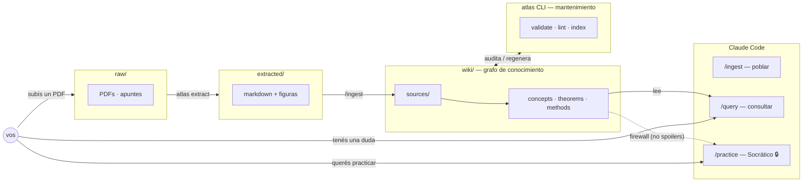

# Atlas

[](https://github.com/AndresPaladino/atlas/actions/workflows/ci.yml)
[](https://www.python.org/)
[](LICENSE)

Sistema personal de conocimiento construido sobre [Claude Code](https://claude.ai/code). Mantiene un wiki interconectado que se popula, consulta y practica con sesiones de Claude. Incluye un CLI (`atlas`) para extracción de PDFs y mantenimiento del grafo.



## Requisitos

- **Python ≥3.10** — para el CLI `atlas`.
- **[Claude Code](https://claude.ai/code)** — requerido para los modos `/ingest`, `/query` y `/practice`. El CLI por sí solo extrae PDFs y mantiene el grafo, pero el valor central (poblar/consultar/practicar) vive en sesiones de Claude.
- **GPU + ~8 GB de modelos** — requeridos solo para `atlas extract` con calidad (marker). Sin GPU, `atlas extract` cae a un fallback de texto plano (markitdown); el resto del CLI no necesita nada de esto. Ver [`tools/README.md`](tools/README.md).

## Instalación

```bash
git clone https://github.com/AndresPaladino/atlas.git
cd atlas
bash setup.sh
```

`setup.sh` crea la estructura del wiki, el directorio `extracted/` (donde `atlas extract` escribe los markdown + figuras) e instala el CLI `atlas`.

Para navegar el wiki en Obsidian, abrí la carpeta `wiki/` como vault (no la raíz del repo).

## Verificá la instalación

Ninguno de estos pasos descarga modelos de ML.

```bash
atlas doctor     # device, torch, tier de extracción y disponibilidad de captions
atlas validate   # valida el frontmatter de todo el wiki (debe decir "0 errores")
atlas lint       # audita el grafo (orphans, links/aristas rotos)
```

`atlas doctor` imprime el diagnóstico del entorno (GPU/CPU, si torch está disponible, qué extractor usará). Si los tres corren sin error, el CLI quedó bien instalado.

## Quickstart — tu primera `/query` sin ingestar nada

El repo trae un **wiki semilla** de 3 páginas autocontenidas (derivada → teorema del valor medio → ejemplo, todo de dominio público) para que pruebes el flujo sin meter un PDF ni descargar modelos.

```bash
claude                                          # abrir Claude Code en la raíz
/query ¿qué dice el teorema del valor medio?    # responde citando el wiki semilla
```

Atlas localiza las páginas `seed-*` en [`wiki/index.md`](wiki/index.md), las lee y sintetiza una respuesta con `[[wikilinks]]`. Si querés ver el contenido sin Claude, abrí [`wiki/theorems/seed-mean-value-theorem.md`](wiki/theorems/seed-mean-value-theorem.md) directamente.

Cuando empieces tu propio wiki, borrá las páginas `seed-*` (`rm wiki/**/seed-*.md && atlas index`).

## Uso

```bash
claude   # abrir Claude Code en la raíz del repositorio
```

| Comando | Para qué |
|---|---|
| `/ingest [ruta]` | Cargar una fuente (PDF, nota) al wiki |
| `/query <pregunta>` | Consultar el wiki |
| `/practice [tema]` | Sesión Socrática (sin soluciones directas) |
| `/lint` | Auditar consistencia del wiki |

Sin slash command, Atlas elige el modo según contexto.

## CLI `atlas`

```bash
# Knowledge graph
atlas validate        # valida frontmatter del wiki
atlas lint            # audita orphans, links rotos, drift
atlas index           # regenera index.md y MOCs

# Extracción de PDFs (raw/ → extracted/)
atlas extract         # convierte PDFs de raw/ a markdown en extracted/
atlas status          # PDFs pendientes / convertidos / desactualizados
```

Ver `tools/README.md` para opciones completas (segmentación, captions con Ollama, etc.).

## Licencia

MIT
